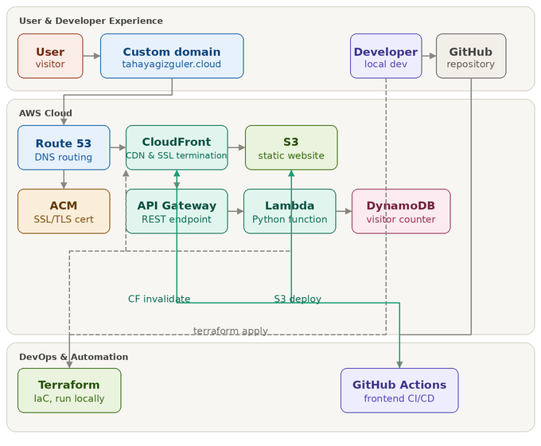

# AWS Cloud Resume Challenge

A production-grade serverless web application built on AWS, featuring a resume website with a real-time visitor counter. This project demonstrates cloud infrastructure best practices using **Infrastructure as Code (IaC)**, **CI/CD automation**, and **serverless architectures**.

---

## 📋 Overview

The **Cloud Resume Challenge** is a hands-on project that simulates real-world cloud deployment scenarios. This implementation showcases:

- ✅ Static website hosting with global CDN delivery
- ✅ Serverless backend API with automatic scaling
- ✅ Real-time visitor analytics using a NoSQL database
- ✅ Full Infrastructure as Code with Terraform
- ✅ Automated CI/CD pipeline using GitHub Actions
- ✅ Custom domain with SSL/TLS encryption
- ✅ Zero-touch deployments on every git push

**Live Demo**: [https://tahayagizguler.cloud](https://tahayagizguler.cloud)

---

## 🏗️ Architecture




---

## 🛠️ Technology Stack

| Category | Technologies |
|----------|--------------|
| **Cloud Provider** |  |
| **Infrastructure as Code** |  |
| **CI/CD** |  |
| **Backend Language** |  |
| **Frontend** | HTML5, CSS3, JavaScript (ES6+) |
| **Database** | Amazon DynamoDB (NoSQL) |
| **CDN** | Amazon CloudFront |
| **DNS** | Amazon Route 53 |

---

## 📦 AWS Services Breakdown

### 🌐 Frontend Delivery

| Service | Purpose | Configuration |
|---------|---------|--------------|
| **Amazon S3** | Static website hosting with versioning and encryption | Bucket configured for static website hosting with public read access blocked (served via CloudFront only) |
| **Amazon CloudFront** | Global CDN with SSL/TLS termination | - Custom domain alias (tahayagizguler.cloud)<br>- HTTPS enforcement (redirect HTTP → HTTPS)<br>- Custom error handling (404 → error.html)<br>- TTL: Default 1 hour, Max 24 hours |
| **AWS Certificate Manager (ACM)** | Free SSL/TLS certificate management | Certificate issued for `tahayagizguler.cloud` with automatic renewal |
| **Amazon Route 53** | DNS management and domain routing | - Hosted zone for `tahayagizguler.cloud`<br>- Alias records pointing to CloudFront distribution<br>- DNS validation for ACM certificate |

### ⚙️ Backend API

| Service | Purpose | Configuration |
|---------|---------|--------------|
| **API Gateway (HTTP API)** | RESTful API endpoint with low latency | - HTTP API (v2) protocol<br>- Route: `GET /`<br>- Auto-deploy to `$default` stage<br>- **Throttling: Rate 5, Burst 10**<br>- CORS configured |
| **AWS Lambda** | Serverless compute for visitor counting | - Runtime: Python 3.8<br>- Handler: `app.lambda_handler`<br>- Embedded in S3 bucket as `src.zip`<br>- Environment variable: `DDB_TABLE=counter`<br>- **Origin validation security** (only allows `https://tahayagizguler.cloud`) |
| **Amazon DynamoDB** | NoSQL database for visitor counter | - Table name: `counter`<br>- Partition key: `id` (Number)<br>- Billing mode: PROVISIONED (1 RCU, 1 WCU)<br>- Attribute: `visitcount` (Number) |

### 🔐 Security & IAM

| Resource | Policy |
|----------|--------|
| **Lambda Execution Role** | - `dynamodb:GetItem` on counter table<br>- `dynamodb:UpdateItem` on counter table<br>- Attached managed policy: `AWSLambdaBasicExecutionRole` |
| **S3 Bucket Policy** | Allows CloudFront Origin Access Identity (OAI) to read objects only |
| **DynamoDB Table** | Encrypted at rest with AWS-managed key |

---

## 🏗️ Infrastructure as Code (Terraform)

### Project Structure

```
cloudresumeAWS/
├── main.tf                 # Root module with random provider & website module
├── website/                # Main infrastructure module
│   ├── variables.tf        # Input variables
│   ├── locals.tf           # Local values & computed names
│   ├── outputs.tf          # Output values (URLs, IDs)
│   ├── s3.tf               # S3 bucket & bucket policy
│   ├── cloudfront.tf       # CloudFront distribution
│   ├── acm.tf              # ACM certificate & validation
│   ├── route53.tf          # Route 53 hosted zone & records
│   ├── dynamodb.tf         # DynamoDB table
│   ├── lambda.tf           # Lambda function, IAM role & policies
│   ├── apigw.tf            # API Gateway & integration
│   └── src/
│       └── app.py          # Python Lambda function
├── website/html/           # Static website source files
│   ├── index.html
│   ├── error.html
│   ├── style.css
│   └── script.js
└── .github/workflows/
    └── main.yml            # CI/CD pipeline definition
```

### Terraform Configuration Details

**Providers Used**:
- `hashicorp/aws` (~> 4.0) - AWS resource management
- `hashicorp/random` (~> 3.1.0) - Random bucket name suffix generation
- `hashicorp/archive` (~> 2.2.0) - Lambda deployment package creation

**Key Resources**:

1. **Random String** (`random_string.bucket_suffix`) - Generates 8-character alphanumeric suffix to ensure S3 bucket name uniqueness globally
2. **S3 Bucket** (`aws_s3_bucket.cloud-resume-bucket`) - Stores static website files and Lambda zip
3. **CloudFront Distribution** (`aws_cloudfront_distribution.s3_cf`) - Serves S3 content globally with HTTPS
4. **ACM Certificate** (`aws_acm_certificate.cert`) - SSL certificate for custom domain
5. **Route 53 Zone** (`aws_route53_zone.main`) - DNS hosting for domain
6. **DynamoDB Table** (`aws_dynamodb_table.visiters`) - Visitor counter storage
7. **Lambda Function** (`aws_lambda_function.apigw_lambda_ddb`) - Visitor counter API logic
8. **API Gateway** (`aws_apigatewayv2_api.http_lambda`) - HTTP endpoint triggering Lambda

**State Management**:
- Terraform state file (`.terraform/terraform.tfstate`) tracks all provisioned resources
- State locking prevents concurrent modifications
- Run `terraform init` to initialize the working directory
- Run `terraform apply` to provision or update infrastructure

**Deployment Commands**:

```bash
# Navigate to project root
cd cloudresumeAWS

# Initialize Terraform (downloads providers & modules)
terraform init

# Review planned changes
terraform plan

# Apply changes (provision resources)
terraform apply

# Destroy all resources (use with caution!)
terraform destroy
```

---

## 🔄 CI/CD Pipeline (GitHub Actions)

The repository includes a fully automated CI/CD pipeline that deploys changes on every push to the `main` branch.

### Workflow: `.github/workflows/main.yml`

```yaml
name: Copy website to S3 and invalidate CloudFront Distribution

on:
  push:
    branches:
      - main
```

### Pipeline Jobs

#### 1. **Copy Website to S3**
- **Action**: `jakejarvis/s3-sync-action@master`
- **Trigger**: Runs on every push to `main`
- **Source**: `website/html/` directory
- **Destination**: S3 bucket (specified via `AWS_S3_BUCKET` secret)
- **Options**:
  - `--follow-symlinks` - Follow symbolic links
  - `--delete` - Remove deleted files from S3
  - `--exclude '.git/*'` - Exclude git metadata

#### 2. **Invalidate CloudFront Cache**
- **Action**: `chetan/invalidate-cloudfront-action@v2`
- **Trigger**: Depends on successful S3 sync completion
- **Action**: Invalidate `/*` paths in CloudFront distribution
- **Purpose**: Ensures users see the latest website version immediately

### Required GitHub Secrets

Configure these secrets in your repository settings (`Settings > Secrets > Actions`):

| Secret Name | Description |
|-------------|-------------|
| `AWS_S3_BUCKET` | Name of the S3 bucket hosting the website |
| `AWS_ACCESS_KEY_ID` | AWS access key with permissions to S3 & CloudFront |
| `AWS_SECRET_ACCESS_KEY` | AWS secret key corresponding to the access key |
| `DISTRIBUTION` | CloudFront distribution ID (e.g., `ABC123DEF456`) |

### IAM Policy for CI/CD

Create an IAM user/role with the following minimal permissions:

```json
{
  "Version": "2012-10-17",
  "Statement": [
    {
      "Effect": "Allow",
      "Action": [
        "s3:PutObject",
        "s3:ListBucket",
        "s3:DeleteObject"
      ],
      "Resource": [
        "arn:aws:s3:::YOUR_BUCKET_NAME",
        "arn:aws:s3:::YOUR_BUCKET_NAME/*"
      ]
    },
    {
      "Effect": "Allow",
      "Action": "cloudfront:CreateInvalidation",
      "Resource": "arn:aws:cloudfront::YOUR_ACCOUNT_ID:distribution/YOUR_DISTRIBUTION_ID"
    }
  ]
}
```

---

## 🔧 Backend API Implementation

### Lambda Function (`website/src/app.py`)

The Lambda function handles visitor counting with atomic DynamoDB operations and Origin-based security:

```python
import boto3
import json

def lambda_handler(event, context):
    ALLOWED_ORIGIN = "https://tahayagizguler.cloud"

    # Security: Validate Origin header (API Gateway passes headers in lowercase)
    headers = event.get('headers', {})
    origin = headers.get('origin', '')
    if not origin or origin != ALLOWED_ORIGIN:
        return {
            "statusCode": 403,
            "headers": {
                "Access-Control-Allow-Origin": ALLOWED_ORIGIN
            },
            "body": json.dumps("Unauthorized")
        }

    TABLE_NAME = "counter"
    db_client = boto3.client('dynamodb')
    dynamodb = boto3.resource('dynamodb')
    table = dynamodb.Table(TABLE_NAME)

    # Atomically increment the visitor count
    update = db_client.update_item(
        TableName=TABLE_NAME,
        Key={"id": {"N": "0"}},
        UpdateExpression="ADD visitcount :inc",
        ExpressionAttributeValues={":inc": {"N": "1"}}
    )

    # Retrieve the updated count
    getItems = table.get_item(Key={"id": 0})
    visitcount = getItems["Item"]["visitcount"]

    return {
        "headers": {"Access-Control-Allow-Origin": ALLOWED_ORIGIN},
        "statusCode": 200,
        "body": json.dumps(str(visitcount))
    }
```

**Key Features**:
- **Atomic increment** using `ADD` operation - prevents race conditions
- **Origin validation** - only accepts requests from authorized domain (`tahayagizguler.cloud`)
- **CORS headers** with specific origin (not wildcard) for security
- **JSON response formatting** using `json.dumps()` for proper content-type
- **Single-item table** strategy with fixed `id: 0` for simplicity

### Frontend Integration (`website/html/script.js`)

```javascript
const VISITOR_API_ENDPOINT = 'https://ci7nir7pm2.execute-api.us-east-1.amazonaws.com/';

async function fetchVisitorCount() {
    try {
        const response = await fetch(VISITOR_API_ENDPOINT);
        const data = await response.json();
        const count = data.count || data.visitors || data.total || data;
        return typeof count === 'number' ? count : parseInt(count, 10) || 0;
    } catch (error) {
        console.error('Failed to fetch visitor count:', error);
        return 0;
    }
}

function updateVisitorCounter() {
    const counterElement = document.getElementById('visitor-count');
    if (counterElement) {
        fetchVisitorCount().then(count => {
            counterElement.textContent = count.toLocaleString('en-US');
        });
    }
}

// Fetch on page load
document.addEventListener('DOMContentLoaded', updateVisitorCounter);
```

---

## 🌍 Domain & SSL Configuration

### Domain Management (Route 53)
- **Domain**: `tahayagizguler.cloud`
- **Hosted Zone**: Created and managed in Route 53
- **Records**:
  - `A` record (apex domain) → CloudFront alias
  - `AAAA` record (IPv6) → CloudFront alias
  - `CNAME` validation records → ACM certificate validation

### SSL/TLS (ACM)
- **Certificate**: Issued by AWS Certificate Manager
- **Validation**: DNS validation via Route 53 automated record creation
- **Status**: `_default_` CloudFront certificate for custom domain
- **Protocol**: TLS 1.2_2021 minimum version
- **Renewal**: Automatic (90 days before expiry)

---

## 🧪 Testing the Deployment

### Frontend
1. Visit `https://tahayagizguler.cloud`
2. Verify the website loads over **HTTPS only** (HTTP redirects to HTTPS)
3. Check browser console for any errors
4. Refresh multiple times - visitor counter should increment

### Backend API
```bash
# Direct API call
curl https://YOUR_API_GATEWAY_ENDPOINT/
# Expected response: {"visitorCount": 123}

# With verbose output
curl -v https://YOUR_API_GATEWAY_ENDPOINT/
```

### Infrastructure
```bash
# Verify Terraform state
terraform state list

# Check individual resources
aws s3 ls s3://YOUR_BUCKET_NAME
aws cloudfront list-distributions
aws dynamodb describe-table --table-name counter
aws apigatewayv2 get-apis
```

---

## 📊 Monitoring & Maintenance

### CloudWatch Metrics
- **Lambda**: Monitor `Invocations`, `Duration`, `Errors`, `Throttles`
- **API Gateway**: Track `Count`, `Latency`, `4XX/5XX` errors
- **DynamoDB**: Monitor `ConsumedReadCapacityUnits`, `ConsumedWriteCapacityUnits`

### Cost Optimization
- **S3**: Storage costs minimal (< $0.023/GB/month)
- **CloudFront**: Data transfer out pricing (first 1TB: $0.085/GB)
- **Lambda**: 1M free requests/month, $0.20 per 1M thereafter
- **DynamoDB**: Provisioned capacity at ~$0.025/hr for 1 RCU/WCU
- **Route 53**: $0.50/month per hosted zone + query charges

**Estimated Monthly Cost**: $1-3 (depending on traffic)

---

## 🔐 Security Best Practices Implemented

- ✅ **HTTPS enforcement** - All HTTP traffic redirects to HTTPS
- ✅ **Principle of least privilege** - IAM roles have minimal required permissions
- ✅ **S3 bucket privacy** - Public access blocked; served via CloudFront OAI only
- ✅ **Encryption at rest** - DynamoDB server-side encryption enabled
- ✅ **API Origin validation** - Lambda function validates Origin header to prevent unauthorized access
- ✅ **Specific CORS configuration** - API returns specific allowed origin (not wildcard)
- ✅ **Rate limiting** - API Gateway throttling (Rate: 5, Burst: 10) prevents abuse
- ✅ **No hardcoded secrets** - All credentials stored in GitHub Secrets/Environment variables
- ✅ **Infrastructure versioning** - Terraform code tracked in Git

---

## 🚀 Future Enhancements

- [ ] Add CloudWatch alarms for Lambda errors & high latency
- [ ] Implement CI/CD for Terraform changes (plan & apply on PR merge)
- [ ] Add WAF (Web Application Firewall) for DDoS protection
- [ ] Enable S3 access logging for audit trails
- [ ] Add cache invalidation optimization (invalidate only changed files)
- [ ] Add multi-region DynamoDB replication with global tables
- [ ] Set up custom domain for API Gateway endpoint
- [ ] Add query parameter support for filtering analytics
- [ ] Implement visitor segmentation (country, device, etc.)

---

## 📚 Resources & References

- [Cloud Resume Challenge Official Guidelines](https://cloudresumechallenge.dev/)
- [AWS S3 Static Website Hosting](https://docs.aws.amazon.com/AmazonS3/latest/userguide/WebsiteHosting.html)
- [CloudFront with S3 Origin](https://docs.aws.amazon.com/AmazonCloudFront/latest/DeveloperGuide/DownloadDistS3AndCustomOrigins.html)
- [Lambda with API Gateway](https://docs.aws.amazon.com/apigateway/latest/developerguide/getting-started-lambda.html)
- [Terraform AWS Provider Documentation](https://registry.terraform.io/providers/hashicorp/aws/latest/docs)
- [GitHub Actions for AWS](https://github.com/actions/aws)

---

## 📄 License

This project is created as part of the Cloud Resume Challenge for educational purposes. Feel free to fork and adapt for your own portfolio.

---

**Built with ❤️ using AWS, Terraform, and Python**
